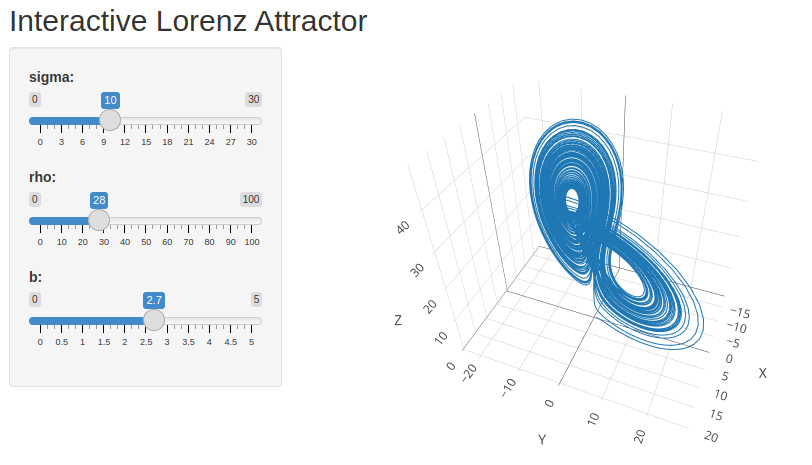

# Lorenz model

Interactive Lorenz model (https://en.wikipedia.org/wiki/Lorenz_system) created in:

- A) R + Shiny
- B) Python + Dash
- C) Python + Streamlit

User can change three parameters of the model - sigma, rho and beta - using sliders and observe the resulted attractor.

---

### A) lorenz.R



---

### B) lorenz.py


---

### C) lorenz-app.py

Streamlit application, which is available on: 
```
https://lorenz-model.streamlit.app/
```


---
